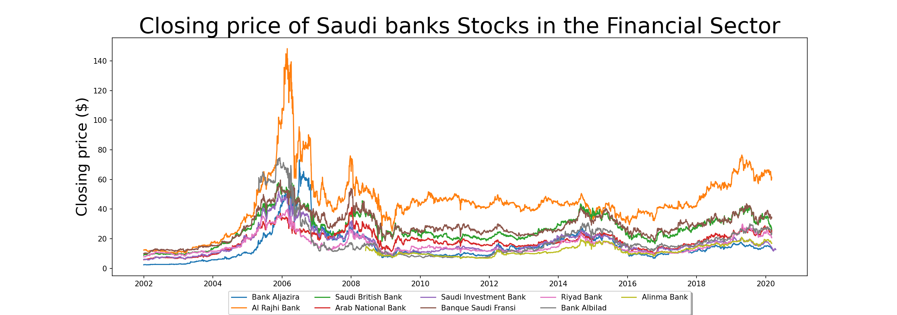
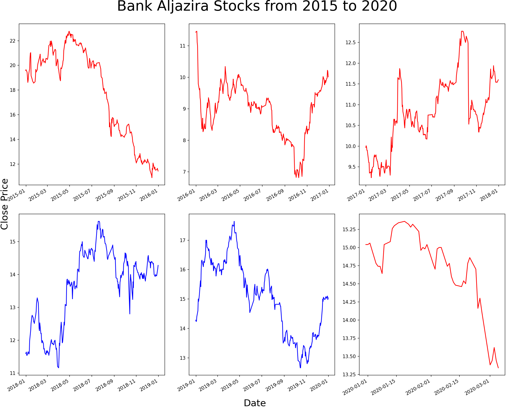
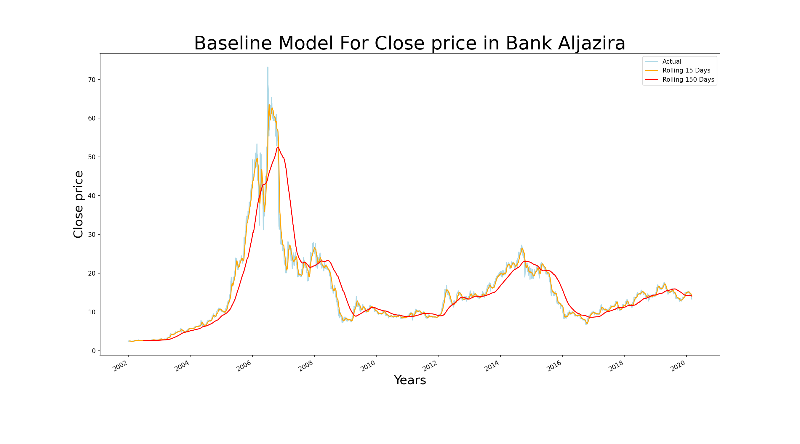

#  Final Project Saudi Stock Exchange (Tadawul)


### Overview:


- Data: Saudi Stock Exchange (Tadawul)
The data of Saudi stock market companies since 2000-01-01. It was collected from Saudi Stock Exchange (Tadawul). 
- The process: 
Selecting some banks in the finical sector to get a good model. Then, studying the features of the Saudi stock market by making different graphs. After that, determining the importance of the features for build a Machine Learning Model.

[The resource](https://www.saudiexchange.sa/wps/portal/tadawul/about/company?locale=en)


### BUSINESSES PROBLEM:


Predicting the Saudi Stock Exchange (Tadawul) is a tempting challenge for data scientists so, when we see Tadawul, we see the daily up and downs, therefore we chose to work on models that predict time series to know the daily closing prices of nine Banks in the Saudi stock market (Tadawul).


### PRE- PROCESSING:


- Cleaning: 

As for handling missing data there was 4 attributes that had some NA values, open, high, low and no_trades.
We handled it by creating a function called high_low_null for the ‘high’ and ‘low’ attributes that uses the ‘ffill’ method, it stands for forward fill null values from 
the previous row.

- Sorting and Filtering:

We applied that by extracting a new data frame with only the Financials sector information to see the suitable bank and changing the date format. Also, we sorted our data by date asc.


[The resource](https://www.kaggle.com/salwaalzahrani/saudi-stock-exchange-tadawul)

### EDA (Exploratory Data Analysis):

#### Closing price of Saudi banks Stocks in the Financial Sector:





#### Difference of the closing price of specific bank and the mean closing price of all the other banks: 


#### Specific bank closing history:


#### Open and close history for Specific bank:
 


#### Increasing and decreasing of closing price in the years from 2016 to 2020




#### Baseline model




## APPROACH:


Since our data is a series data the best approach is to use TimeSeriesSplit. As for the machine learning models in this project DecisionTreeRegressor and RandomForestRegressor was used. Both algorithms were used in this project because some banks gave a better accuracy than the other.

#### The features and target: 

```python

X= df_x [['symbol', 'open', 'high', 'low', 'change', 'perc_Change', 'volume_traded ', 'value_traded' ]] # Features
y= df_x['close'] # Target

```

### Prediction:


### RESULTS:

| Bank name | Models name | Train MAE |  Test MAE |
| --- | --- | --- | --- |
| BJAZ | RandomForestRegressor | 0.08715 | 0.07609 |
| ALRAJHI | RandomForestRegressor | 0.29791 | 0.35278 |
| SABB | RandomForestRegressor | 0.12003 | 0.18621 |
| ANB | RandomForestRegressor | 0.17330 | 0.17733 |
| SAIB | RandomForestRegressor | 0.08207 | 0.08863 |
| BSFR | RandomForestRegressor | 0.12547 | 0.19570 |
| RIBL | RandomForestRegressor | 0.13954 | 0.18136 |
| ALBILAD | RandomForestRegressor | 0.15506 | 0.20082 |
| ALINMA | DecisionTreeRegressor | 0.10928 | 0.19276 |


The Random Forest and Decision Tree models performed effectively in most banks. But Random Forest model was more effective than the Decision Tree Model in most. In the Decision Tree Model, the error rate was less than 2%, except in Alinma Bank, the Decision Tree Model performed better than the Random Forest Model by 20%.


You can see our Blog on [medium](https://medium.com/@razanAlsallumi/saudi-stock-exchange-tadawul-9d84b2c15852)

You can see our dashboard on [Tableau](https://public.tableau.com/app/profile/waad.alsaleh/viz/Tadawul/TadawulDashbord)

   
   
